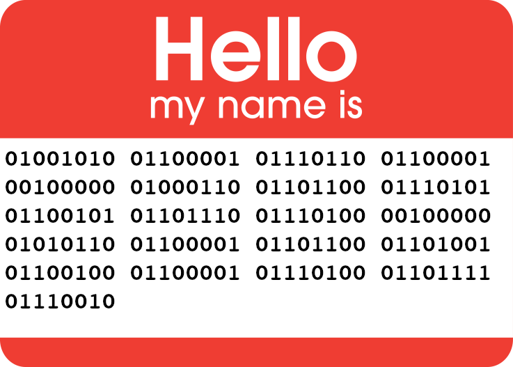

<p align="left">
  
</p>

# Java Fluent Validator

[](https://travis-ci.org/mvallim/java-fluent-validator)
[](https://sonarcloud.io/dashboard?id=java-fluent-validator)
[](https://sonarcloud.io/dashboard?id=java-fluent-validator)
[](https://maven-badges.herokuapp.com/maven-central/com.github.mvallim/java-fluent-validator)
[](http://www.apache.org/licenses/LICENSE-2.0)

> **(Documentation is under construction)**

Validating data is a common task that occurs throughout any application, especially the business logic layer. As for some quite complex scenarios, often the same or similar validations are scattered everywhere, thus it is hard to reuse code and break the [DRY](https://en.wikipedia.org/wiki/Don%27t_repeat_yourself) rule.

## Sample

```java
public class ValidatorBoy extends AbstractValidator<Boy>{

    @Override
    protected void rules() {

        ruleFor(Boy::getGender)
            .when(not(nullValue(Gender.class)))
                .must(equalTo(Gender.MALE))
                .withMessage("gender of boy must be MALE")
                .withFieldName("gender")
                .critical();

        ruleFor(Boy::getName)
            .when(not(stringEmptyOrNull()))
                .must(stringContains("John"))
                .withMessage("child name must contains key John")
                .withFieldName("name");
    }

}
```

## Index

1. [Quick start](documentation/1-quick-start.md)
   - [Step by Step](documentation/2-step-by-step.md)
   - [Spring support](documentation/3-spring-support.md)
2. [Validator](documentation/4-validator-methods.md)
3. [Builder](documentation/5-builder-methods.md)
4. [Predicate](documentation/6-predicate-methods.md)
5. Examples
   - [Samples](src/test/java/br/com/fluentvalidator/ValidatorTest.java)
   - [Spring support samples](src/test/java/br/com/fluentvalidator/spring/ValidatorSpringTest.java)

## Contributing

Please read [CONTRIBUTING.md](CONTRIBUTING.md) for details on our code of conduct, and the process for submitting pull requests to us.

## Versioning

We use [GitHub](https://github.com/mvallim/java-fluent-validator) for versioning. For the versions available, see the [tags on this repository](https://github.com/mvallim/java-fluent-validator/tags).

## Authors

* **Marcos Vallim** - *Initial work, Development, Test, Documentation* - [mvallim](https://github.com/mvallim)

See also the list of [contributors](CONTRIBUTORS.txt) who participated in this project.

## License

This project is licensed under the Apache License - see the [LICENSE](LICENSE) file for details
